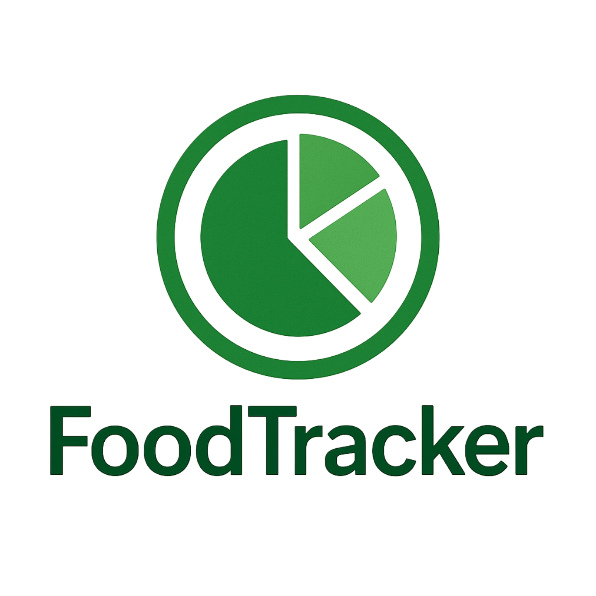
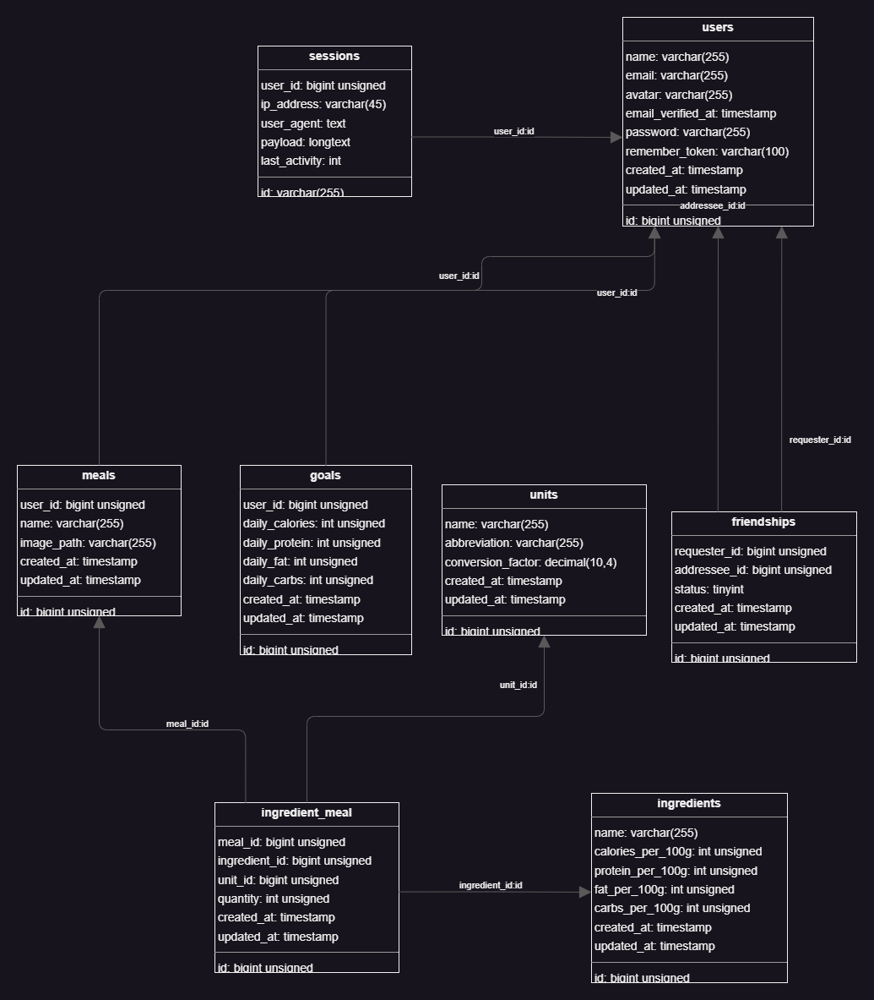

# FoodTracker - A Laravel Meal Tracking Application

<p align="center">

</p>

FoodTracker is a web application built with the Laravel framework to help you track your daily meals and calculate their nutritional information. It provides a clean, simple interface for adding meals, managing ingredients, and viewing a summary of your intake.

## About The Project

This application was built as a step-by-step project to explore core Laravel features. It demonstrates user authentication, CRUD (Create, Read, Update, Delete) operations, database relationships (many-to-many), and building custom, dynamic front-end components with vanilla JavaScript.

**Core Technologies Used:**

* [Laravel](https://laravel.com/)
* [Laravel Breeze](https://www.google.com/search?q=https://laravel.com/docs/starter-kits%23laravel-breeze) for authentication
* [Blade](https://laravel.com/docs/blade) Templating Engine
* [Tailwind CSS](https://tailwindcss.com/)
* Vanilla JavaScript for custom UI components
* MySQL

## Features

* **User Authentication**: Secure user registration and login.
* **Meal Management**: Full CRUD functionality for meals. Users can add, view, edit, and delete their own meals.
* **Image Uploads**: Users can upload an image for each meal.
* **Dynamic Ingredient Form**: Add multiple ingredients to a single meal on the fly.
* **Automatic Nutritional Calculation**: View a summary of total calories, protein, fat, and carbs for each meal.
* **Database Seeding**: Comes pre-populated with a comprehensive list of common ingredients and measurement units.

## Database Schema

The application's data is structured around several key models that are interconnected to track meals, their ingredients, and social connections.

### Entity-Relationship Diagram (ERD)

This image bellow shows relationships between the main database tables.

<p align="center">

</p>

### Table Descriptions

* **users**: Stores user account information (name, email, password). Provided by Laravel Breeze. It has a self-referencing many-to-many relationship to model friendships.
* **goals**: Stores a user's personal nutritional goals (e.g., target daily calories). It has a one-to-one relationship with a user.
* **meals**: Stores information about a specific meal, including its name and an optional image. Each meal belongs to one user.
* **ingredients**: A master list of all possible ingredients and their base nutritional information (per 100g).
* **units**: A master list of measurement units (e.g., 'gram', 'kilogram') and their conversion factors to grams.
* **ingredient_meal**: This is a pivot table that connects meals and ingredients in a many-to-many relationship. It stores the specific quantity of an ingredient and the unit_id used for a particular meal.
* **friendships**: A pivot-like table that manages the many-to-many relationship between users. It stores the requester_id, the addressee_id, and a status to track pending, accepted, or declined friend requests.


## Getting Started

Follow these instructions to get a local copy of the project up and running for development and testing purposes.

### Prerequisites

* PHP (\>= 8.2)
* [Composer](https://getcomposer.org/)
* Node.js & NPM
* A database server (e.g., MySQL)

### Installation

1.  **Clone the repository**

    ```bash
    git clone https://github.com/your-username/foodtracker.git
    cd foodtracker
    ```

2.  **Install dependencies**

    ```bash
    composer install
    npm install
    ```

3.  **Set up your environment file**

    * Copy the example environment file:
      ```bash
      cp .env.example .env
      ```
    * Open the `.env` file and configure your database connection, primarily these lines:
      ```ini
      DB_CONNECTION=mysql
      DB_HOST=127.0.0.1
      DB_PORT=3306
      DB_DATABASE=foodtracker
      DB_USERNAME=your_mysql_username
      DB_PASSWORD=your_mysql_password
      ```
    * Make sure you have created the `foodtracker` database in your MySQL client.

4.  **Generate your application key**

    ```bash
    php artisan key:generate
    ```

5.  **Run the database migrations and seeders**

    * This command will set up all the necessary tables and populate your `ingredients` and `units` tables with sample data.

    <!-- end list -->

    ```bash
    php artisan migrate:fresh --seed
    ```

6.  **Link the storage directory**

    * This makes your uploaded meal images publicly accessible.

    <!-- end list -->

    ```bash
    php artisan storage:link
    ```

7.  **Compile front-end assets**

    ```bash
    npm run dev
    ```


8.  **Start the development server**

    * In a new terminal:

    <!-- end list -->

    ```bash
    php artisan serve
    ```

You can now access the application at `http://127.0.0.1:8000`. You can register a new user account to begin.

## License

The FoodTracker application is open-sourced software licensed under the [MIT license](https://opensource.org/licenses/MIT).
